# バトル画面の状態遷移

ルールは [バトルのルール](../../01_requirements/battle/01_バトルのルール.md)。ここでは、画面が取る状態と、状態ごとの表示の出し分けを決める。実装は `battle-reducer.ts`（状態遷移）と `scoring.ts`（ダメージ・評価）。



> 図のソースは [`01_バトル画面の状態遷移.01.mmd`](./01_バトル画面の状態遷移.01.mmd)（mermaid）。編集後は次で再生成する（プロジェクトのルートフォルダで実行。要 Docker Desktop 起動）:
>
> ```powershell
> docker run --rm -v ${PWD}:/data minlag/mermaid-cli:11.12.0 -i docs/specs/02_basic-design/battle/01_バトル画面の状態遷移.01.mmd -o docs/specs/02_basic-design/battle/01_バトル画面の状態遷移.01.svg
> ```

## バトルが持つ状態

| 項目 | 初期値 | 内容 |
| --- | --- | --- |
| `phase` | 読み込み中 | 上の図の状態 |
| `slot` | 0 | 何問目か（0〜4）。0〜2が通常問題、3〜4がとどめ問題。画面には `slot + 1` を「n / 5問」と表示する |
| `isRetry` | `false` | とどめ問題の出し直しか |
| `choiceOrder` | 問題データの並び | 選択肢IDの並び。画面のA・B・Cに順に当てる |
| `hp` | 500 | ボスの残りHP |
| `life` | 3 | 残りライフ |
| `combo` | 0 | 連続で正解した数（出し直しの解答も1回に数える） |
| `normalWrong` | 空 | 通常問題で間違えた問題（間違えた順）。とどめ問題の決定に使う |
| `reviewList` | 空 | 結果画面の「ふりかえり」に出す問題（今回の最初の解答が不正解だった問題。通常・とどめを問わず、間違えた順） |

## 状態の遷移

| 今の状態         | きっかけ      | 更新する値                                                                            | 次の状態       |
| ------------ | --------- | -------------------------------------------------------------------------------- | ---------- |
| 読み込み中        | 出題APIが成功  | ボスを選び、`lastBossId` を保存する（[選び方](../boss-zukan/01_ボスデータと選び方.md#ボスの選び方)）。`slot` = 0 | 解答待ち       |
| 読み込み中        | 出題APIが失敗  |                                                                                  | 取得エラー      |
| 解答待ち（通常）     | 正解        | `hp` −100、`combo` +1                                                             | 正解表示       |
| 解答待ち（通常）     | 不正解       | `life` −1（0未満にしない）、`combo` = 0、`normalWrong` に追加                                 | 不正解表示      |
| 解答待ち（とどめ1問目） | 正解        | `hp` −（`hp` の半分）、`combo` +1                                                      | 正解表示       |
| 解答待ち（とどめ2問目） | 正解        | `hp` = 0、`combo` +1                                                              | とどめの一撃     |
| 解答待ち（とどめ）    | 不正解       | `combo` = 0（`life` は変えない）                                                        | 不正解表示      |
| 解答待ち         | 最初の解答が不正解 | `reviewList` に追加（出し直しの不正解では追加しない）                                                |            |
| 正解表示         | 約1秒経過     | `slot` +1、`isRetry` = `false`                                                    | 解答待ち       |
| 不正解表示（通常）    | 「わかった」    | `slot` +1                                                                        | 解答待ち       |
| 不正解表示（とどめ）   | 「わかった」    | `isRetry` = `true`、`choiceOrder` を並べ替える                                          | 解答待ち（同じ問題） |
| とどめの一撃       | 約2秒経過     | 結果を作る（[結果画面の表示](02_結果画面の表示.md)）                                                  | 結果画面へ      |
| 取得エラー        | 「もういちど」   |                                                                                  | 読み込み中      |

- 「とどめ1問目の半分」はHPが100の倍数なので、常に整数になる。
- `slot` が通常問題の最後（2）から3へ進むときに、[とどめ問題を決める](../question-api/01_出題の選び方.md#返す5問の意味)。
- 出し直しの並べ替えは、**正解の選択肢の位置が前回と変わる**ように並べ替える（ランダムに並べ替え、同じ位置になったらやり直す）。A・B・Cのラベルの位置は固定で、中身だけが入れ替わる。
- 1問ごとに答えた時点で、[端末側の記録](../question-api/01_出題の選び方.md#端末側の記録)（まちがえた問題の保存）を行う。最初の解答だけが対象で、出し直しは対象外。
- 通常問題・とどめ問題とも、解答待ちのときだけ選択肢をタップできる。
- 正解表示で約1秒待つのは、「せいかい」の表示・HPバーが減るところ・正解音を目にしてから次の問題へ進めるため。正解のときはボタンを押さずに自動で進むので、待たないと手応えが伝わらない。長くするとテンポが落ち、1バトル約1分に収まりにくくなるため、短めにしている。
- 不正解表示を時間で区切らず「わかった」で進めるのは、解説を読む速さが人によって違うため。
- とどめの一撃で約2秒待つのは、バトル最後の盛り上がりとして「とどめの一撃！」とダメージの数字を見せてから結果画面へ移るため。通常の正解より長めにしている。

## 表示の出し分け

画面の見た目は [screens.html](../../mock/screens.html) と [DESIGN.md](../../../../DESIGN.md)。ここでは条件だけを決める。

| 表示 | 出す条件 | 内容 |
| --- | --- | --- |
| 上部 | 常に | 「`slot + 1` / 5問」、ハート3つ（`life` の数だけ塗る） |
| 怒りモード | `life` が 0 | 背景・ボスの丸・名前・💢・吹き出しを切り替える。解説を表示している間（ライフが0になった問題の直後）から始まる。表示内容は [バトルのルール](../../01_requirements/battle/01_バトルのルール.md#怒りモードライフ0) |
| ボス名 | 常に | 通常はボス名、怒りモードは「いかりの」＋ボス名 |
| HP | 常に | 「HP `hp` / 500」と、`hp / 500` の幅のバー |
| コンボ | `combo` が 2 以上 | 「`combo`コンボ！」（例：3コンボ！）。HPの行の右側 |
| とどめタグ | `slot` が 3・4 で、とどめの一撃の状態ではない | 「とどめ問題 1/2」（`slot` 3）・「とどめ問題 2/2」（`slot` 4）。HPの行の右側。コンボと並べて出す |
| 進み具合バー | 常に | 幅は `(slot + 1) / 5`（出し直しでは変わらない） |
| 出し直しの案内 | `isRetry` が `true` | 問題文の上に「もういちど こたえてね」 |
| 正解の表示 | 正解表示・とどめの一撃 | 選んだ選択肢を緑にして「せいかい」。ほかの選択肢は押せない |
| 不正解の表示 | 不正解表示 | 選んだ選択肢を赤にして「✕」。正解の選択肢は緑にして「せいかい」と光らせる。残りは薄くする |
| 解説欄・「わかった」 | 不正解表示 | 「ひっかけポイント」の見出しと、問題データの `explanation`。ボスの丸は小さくする |
| とどめの一撃の演出 | とどめの一撃 | ボスの丸を薄くし、重ねて「とどめの一撃！」と、このとどめのダメージ（2問目に正解する直前の `hp`）を大きな数字で出す。HPバーを0にする |
| 音 | 正解・不正解 | 正解音・不正解音を1回鳴らす（サウンドがONのとき）。出し直しの解答でも鳴らす |

- とどめ1問目では、ダメージの大きな数字は出さない（HPバーが減るだけ）。
