# 画面遷移図

URL・遷移ごとの履歴の扱い・直接開いたときの動作は [URLと画面遷移](common/01_URLと画面遷移.md)。



> 図のソースは [`画面遷移図.01.mmd`](./画面遷移図.01.mmd)（mermaid）。編集後は次で再生成する（プロジェクトのルートフォルダで実行。要 Docker Desktop 起動）:
>
> ```powershell
> docker run --rm -v ${PWD}:/data minlag/mermaid-cli:11.12.0 -i docs/specs/02_basic-design/画面遷移図.01.mmd -o docs/specs/02_basic-design/画面遷移図.01.svg
> ```
